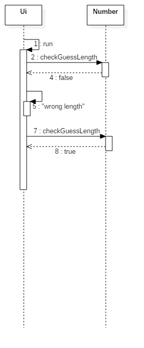
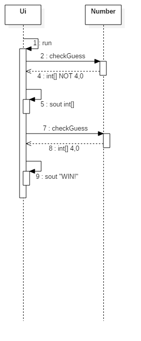
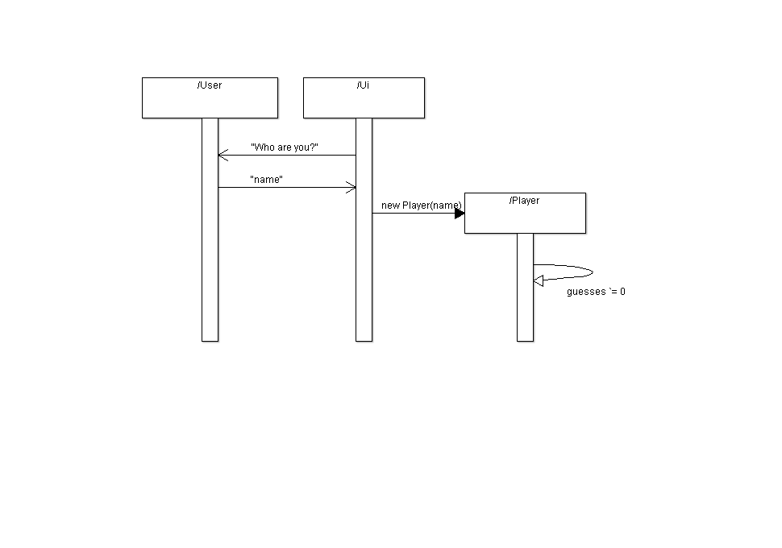
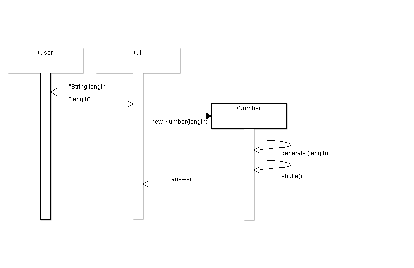

## Aiheenmäärittely

Kuten Pickover, Clifford A:n The Math Book (2009) noteerasi: 

> [it was] the most successful new game of the 1970s. (Pickover, Clifford, 442)

**Aihe:** Kyse on israelilaisen Mordecai Meirowitzin luomasta **Mastermind** nimisestä lautapelistä, jossa yhden pelaajan tulee pyrkiä ratkaisemaan toisen pelaajan rakentama värikoodi. Pähkinänkuoressa se sisältää eri värisiä nappuloita, joista toinen valitsee haluamansa yhdistelmän ja piilottaa tämän yhdistelmän vastapelaajaltaan. Yhdistelmiä on yhteensä 1296. Ratkaisija tekee arvauksen ja laittaa sitä vastaavat pallot omaan riviinsä. Peli etenee niin, että vastaaja kertoo moniko pallo arvaajalla on oikean värinen ja oikealla paikalla (merkitään punaisella) ja moniko pallo on oikean värinen, mutta väärällä paikalla (merkitään valkoisella). Neljä punaista merkkiä tarkoittaa oikeaa vastausta.

Käytännössä tulevaa peliä kuvaavat seuraavat suuntaviivat: 

- [x] Se toteutetaan Javalla
- [x] Käyttäjä syöttää oman nimensä pelille
- [x] Käyttäjä syöttää haluamansa pituuden pelin generoimalle koodille
- [x] Peli pitää lukua käyttäjän arvausten määrästä
- [x] Peli ilmoittaa käyttäjälle jokaisen arvauksen jälkeen täysin oikeiden arvausten (blacks) ja melkein oikeiden arvausten (whites) määrät
- [x] Käyttäjän arvatessa koodin, peli kysyy käyttäjälktä, haluaako tämä jatkaa peliä (y/n?) ja lopettaa mikäli käyttäjä vastaa ei (n).   

**Käyttäjät:** Opiskelija, Opetushallinto, sekä lähiössä lopeensa arkeensa tylsistynyt individuaali

**Kaikkien käyttäjien toiminnot:** 

	-kertoa pelille, kuka käyttäjä on
	-kertoa pelille, minkä pituisen koodin haluaa ratkaista. 
	-oikean rivin arvaus
	-kertoa pelille, haluaako jatkaa vai ei.

**Koneen toiminnot:**

	-kysyy käyttäjän nime'.
	-kysyy, miten pitkän koodin käyttäjä haluaa ratkaistavaksi.
	-antaa käyttäjälle koodin.
	-tarkistaa käyttäjän arvauksen 
	-ilmoittaa käyttäjän täysin oikeiden ja melkein oikeiden arvausten määrät.
	-kertoo käyttäjälle, kun koodi on täysin oikea.
	-ilmoittaa myös arvausten määrän.
	-kysyy käyttäjältä, haluaako tämä jatkaa vai ei.

### Luokkakaavio 

### Sekvenssikaaviot

 - Käyttötapaus: Käyttäjä syöttää väärän ja sitten oikean pituisen koodin.  Käyttöliittymä käynnistyy ja tarkistaa Number-luokalta käyttäjän antaman koodin pituutta.   
Käyttäjän syöttäessä väärän pituisen koodin, palauttaa Number-luokka falsen ja käyttäjälle tulostuu "Wrong Length". Käyttäjän arvatessa uudelleen pituutta Käyttöliittymä varmistaa Number-luokalta pituuden ja tämän ollessa sama, palautuu true. 

 - Käyttötapaus: Käyttäjä syöttää väärän määrän täysin oikeita (blacks) ja melkein oikeita (whites) ja sen jälkeen syöttää oikean määrän täysin oikeita, voittaen pelin. Käyttöliittymä tarkistaa arvauksen täysin oikeiden ja melkein oikeiden määrät Number-luokalta, joka palauttaa taulukkona määrät ja käyttäjälle tulostuu hänen saamansa täysin oikeiden ja melkein oikeiden arvaustensa määrä. Kun käyttäjä arvaa oikein, Number-luokka palauttaa taulukon ja käyttäjälle tulostuu ilmoitus hänen voitostaan.

 - Käyttötapaus: Käyttäjä luo nimen peliin. Käyttöliittymä kysyy käyttäjältä "Who are you?" ja käyttäjä syöttää nimensä kenttään. Käyttöliittymä luo uuden Player-olion kyseisellä nimellä Player-luokkaan ja samalla arvausten määrän lukuarvo "guesses" käynnistyy.

 - Käyttötapaus: Käyttäjä luo haluamansa pituisen koodin. Käyttöliittymä kysyy pituutta käyttäjältä, käyttäjä syöttää kenttään haluamansa koodin pituuden. Käyttöliittymä luo uuden Number-olion Number-luokkaan ja Number-luokan metodit generate() ja shuffle() muodostavat kyseisen pituisen koodin, ja luokka palauttaa sen vastauksena ("answer").

